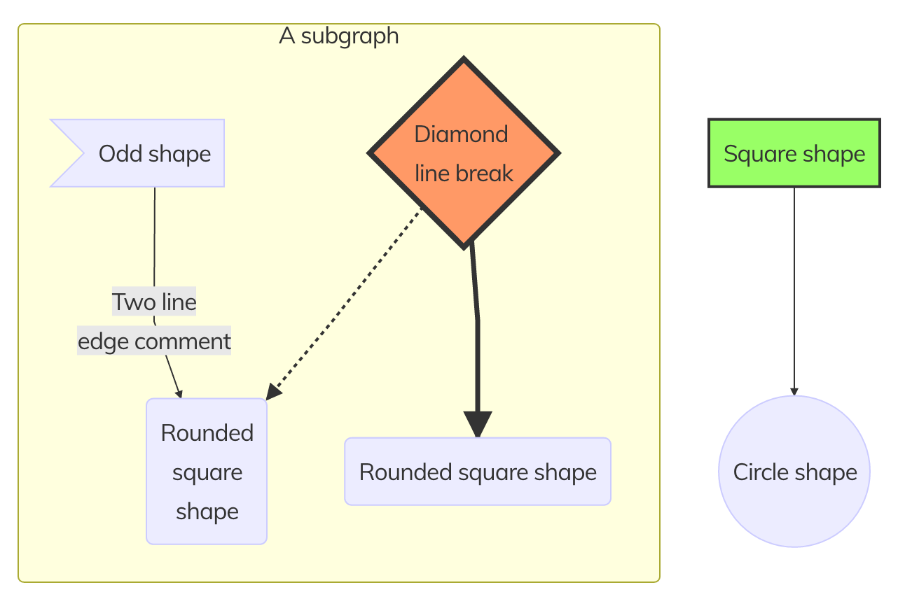

# Mermaid Diagrams Plugin

The **Mermaid Diagrams** plugin is an extension for [Grav CMS](http://github.com/getgrav/grav) that adds the simple and powerful [mermaid diagram language](https://mermaidjs.github.io/) to Grav. Diagrams are generated dynamically in the visitor's browser, thanks to mermaid's use of [D3.js](https://d3js.org/) and [dagre-d3](https://github.com/dagrejs/dagre-d3).

> **This plugin is maintained lazily.** Updates--such as bumping the Mermaid library's version--aren't made unless someone specifically asks. If you want the newest version of Mermaid, speak up on https://github.com/DanielFlaum/grav-plugin-mermaid-diagrams/issues/3. For anything else, make an issue. Cheers!

# Installation

Installing the Diagrams plugin can be done in one of two ways. GPM (Grav Package Manager) installation method enables you to quickly and easily install the plugin with a simple terminal command, while the manual method enables you to do so via a zip file.

## GPM Installation (Preferred)

The simplest way to install this plugin is via the [Grav Package Manager (GPM)](http://learn.getgrav.org/advanced/grav-gpm) through your system's Terminal (also called the command line). From the root of your Grav install type:

    bin/gpm install mermaid-diagrams

This will install the Mermaid Diagrams plugin into your `/user/plugins` directory within Grav. Its files can be found under `/your/site/grav/user/plugins/mermaid-diagrams`.

## Manual Installation

To install this plugin, just download the zip version of this repository and unzip it under `/your/site/grav/user/plugins`. Then, rename the folder to `mermaid-diagrams`. You can find these files either on [GitHub](https://github.com/DanielFlaum/grav-plugin-mermaid-diagrams).

You should now have all the plugin files under

    /your/site/grav/user/plugins/mermaid-diagrams

> Note: This plugin is a modular component for Grav which requires [Grav](http://github.com/getgrav/grav) and a theme to be installed in order to operate.

# Usage

The plug-in is configured to be functional as soon as you finish installation.

To add a mermaid diagram to your page, simply wrap its textual description within `[mermaid]` and `[/mermaid]` tags, as seen here:

```mermaid
[mermaid]
graph TB
sq[Square shape] --> ci((Circle shape))

subgraph A subgraph
    od>Odd shape]-- Two line<br>edge comment --> ro
    di{Diamond <br/> line break} -.-> ro(Rounded<br>square<br>shape)
    di==>ro2(Rounded square shape)
end

classDef green fill:#9f6,stroke:#333,stroke-width:2px;
classDef orange fill:#f96,stroke:#333,stroke-width:4px;
class sq,e green
class di orange
[/mermaid]
```

The plugin will transform this sequence to display the following diagram:

<p align="center">
  <br/>
  <i>Created diagram</i>
</p>

# Settings

You can parameterize the plugin to suit your usage

```yaml
# General settings
# ****************

enabled: true	# Plugin activation
```

# Updating

As development for the Mermaid Diagrams plugin continues, new versions may become available that add additional features and functionality, improve compatibility with newer Grav releases, and generally provide a better user experience. Updating Mermaid Diagrams is easy, and can be done through Grav's GPM system, as well as manually.

## GPM Update (Preferred)

The simplest way to update this plugin is via the [Grav Package Manager (GPM)](http://learn.getgrav.org/advanced/grav-gpm). You can do this with this by navigating to the root directory of your Grav install using your system's Terminal (also called command line) and typing the following:

    bin/gpm update mermaid-diagrams

This command will check your Grav install to see if your Mermaid Diagrams plugin is due for an update. If a newer release is found, you will be asked whether or not you wish to update. To continue, type `y` and hit enter. The plugin will automatically update and clear Grav's cache.

> Note: Any changes you have made to any of the files listed under this directory will also be removed and replaced by the new set. Any files located elsewhere (for example a YAML settings file placed in `user/config/plugins`) will remain intact.

## Manual Update

Manually updating Diagrams is pretty simple. Here is what you will need to do to get this done:

* Delete the `your/site/user/plugins/mermaid-diagrams` directory.
* Download the new version of the Mermaid Diagrams plugin from [GitHub](https://github.com/DanielFlaum/grav-plugin-mermaid-diagrams) as a zip file.
* Unzip the zip file in `your/site/user/plugins` and rename the resulting folder to `mermaid-diagrams`.
* Clear the Grav cache. The simplest way to do this is by going to the root Grav directory in terminal and typing `bin/grav clear-cache`.

# Credit

This plugin was forked from [Aurélien Wolz's](https://github.com/Seao) excellent [Diagram Plugin](https://github.com/Seao/grav-plugin-diagrams). Many thanks to him for sharing it with everyone.
